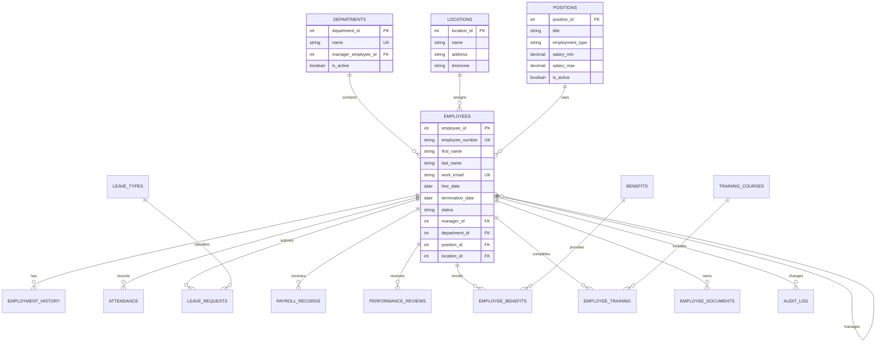

# Employee Database Design

## 1. Purpose

This design supports a company’s employee master data and common HR processes:

- employee profiles and contact details
- departments, locations, and job positions
- reporting relationships and employment history
- attendance, leave, payroll, benefits, and performance
- training, documents, user access, and audit history

The design is normalized so that employee information is stored once and reused by other HR modules.

## 2. Main relationships

## 3. Core tables

### `employees`

| Column | Type | Notes |
|---|---|---|
| `employee_id` | integer | Primary key |
| `employee_number` | varchar(30) | Unique company identifier |
| `first_name` | varchar(100) | Required |
| `middle_name` | varchar(100) | Optional |
| `last_name` | varchar(100) | Required |
| `preferred_name` | varchar(100) | Optional |
| `work_email` | varchar(255) | Unique, required |
| `personal_email` | varchar(255) | Optional |
| `phone` | varchar(40) | Optional |
| `date_of_birth` | date | Restrict access; encrypt if required |
| `hire_date` | date | Required |
| `termination_date` | date | Null for active employees |
| `status` | varchar(20) | `active`, `on_leave`, `terminated`, `inactive` |
| `department_id` | integer | Foreign key to `departments` |
| `position_id` | integer | Foreign key to `positions` |
| `location_id` | integer | Foreign key to `locations` |
| `manager_id` | integer | Self-reference to `employees` |
| `created_at` | timestamp | Record creation time |
| `updated_at` | timestamp | Last modification time |

### `departments`

Stores organizational units such as Finance, Operations, or Engineering.

Fields: `department_id`, `name`, `code`, `manager_employee_id`, `parent_department_id`, `is_active`, `created_at`, `updated_at`.

### `positions`

Stores job definitions independently from employees.

Fields: `position_id`, `title`, `code`, `employment_type`, `pay_grade`, `salary_min`, `salary_max`, `is_active`.

Suggested `employment_type` values: `full_time`, `part_time`, `contractor`, `intern`, `temporary`.

### `locations`

Stores offices, branches, or remote work locations.

Fields: `location_id`, `name`, `address_line_1`, `address_line_2`, `city`, `state_province`, `postal_code`, `country`, `timezone`, `is_active`.

### `employment_history`

Keeps historical department, position, manager, salary, and status changes rather than overwriting the employee’s past.

Fields: `history_id`, `employee_id`, `effective_from`, `effective_to`, `department_id`, `position_id`, `manager_id`, `employment_type`, `salary`, `status`, `reason`.

## 4. HR module tables

### Attendance

`attendance`: `attendance_id`, `employee_id`, `work_date`, `clock_in`, `clock_out`, `status`, `hours_worked`, `notes`.

Add a unique constraint on `employee_id + work_date` if there should be only one daily record per employee.

### Leave management

`leave_types`: `leave_type_id`, `name`, `days_per_year`, `requires_approval`, `is_paid`.

`leave_requests`: `leave_request_id`, `employee_id`, `leave_type_id`, `start_date`, `end_date`, `total_days`, `reason`, `status`, `approved_by`, `approved_at`, `created_at`.

Suggested status values: `pending`, `approved`, `rejected`, `cancelled`.

### Payroll

`payroll_records`: `payroll_id`, `employee_id`, `pay_period_start`, `pay_period_end`, `gross_pay`, `tax_amount`, `deductions`, `net_pay`, `currency`, `payment_date`, `status`.

Payroll data should have stricter access controls than general employee data. Do not store full bank account numbers unless required; tokenize or encrypt them.

### Benefits

`benefits`: `benefit_id`, `name`, `provider`, `description`, `is_active`.

`employee_benefits`: `employee_benefit_id`, `employee_id`, `benefit_id`, `enrollment_date`, `end_date`, `employee_contribution`, `employer_contribution`, `status`.

### Performance

`performance_reviews`: `review_id`, `employee_id`, `reviewer_id`, `review_period_start`, `review_period_end`, `rating`, `summary`, `goals`, `status`, `submitted_at`.

### Training

`training_courses`: `course_id`, `name`, `provider`, `description`, `validity_months`, `is_active`.

`employee_training`: `employee_training_id`, `employee_id`, `course_id`, `completed_on`, `expires_on`, `result`, `certificate_reference`.

### Documents

`employee_documents`: `document_id`, `employee_id`, `document_type`, `file_name`, `storage_key`, `uploaded_by`, `uploaded_at`, `expires_at`, `is_confidential`.

Store files in secure object storage and keep only the storage reference in the database. Avoid storing document binaries directly in the employee table.

## 5. Access and audit tables

### `users`

Application login records: `user_id`, `employee_id`, `username`, `password_hash`, `role_id`, `is_active`, `last_login_at`.

Passwords must be stored only as strong password hashes. Never store plain-text passwords.

### `roles` and `role_permissions`

Use roles such as:

- `employee`: own profile and requests
- `manager`: direct reports and approvals
- `hr_admin`: employee and HR records
- `payroll_admin`: payroll only
- `system_admin`: technical administration

### `audit_log`

Tracks sensitive changes: `audit_id`, `user_id`, `employee_id`, `action`, `table_name`, `record_id`, `old_values`, `new_values`, `created_at`, `ip_address`.

## 6. Important constraints

- `employee_number` and `work_email` must be unique.
- An employee’s `termination_date` cannot be earlier than `hire_date`.
- Leave requests must have `end_date >= start_date`.
- Payroll periods must not overlap for the same employee.
- A manager should not report to themselves.
- Foreign keys should use `ON DELETE RESTRICT` for historical HR records.
- Use `created_at`, `updated_at`, and preferably `created_by`/`updated_by` on important tables.
- Add indexes on `work_email`, `employee_number`, `department_id`, `manager_id`, `status`, and date fields used for reports.

## 7. Recommended implementation order

1. `departments`, `locations`, `positions`
2. `employees` and `employment_history`
3. `users`, `roles`, and permissions
4. leave and attendance
5. payroll and benefits
6. performance, training, documents, and audit logging

## 8. Practical dashboard views

- employee directory with department, position, location, and status
- headcount by department and employment type
- upcoming birthdays, probation endings, and document expirations
- pending leave approvals
- attendance exceptions
- payroll summary by pay period
- training and certification expirations

## 9. Data protection

Treat date of birth, government IDs, payroll, bank details, medical information, and uploaded identity documents as restricted data. Apply least-privilege access, encryption in transit and at rest, retention rules, backups, and audit logging. Collect only fields the company genuinely needs.
